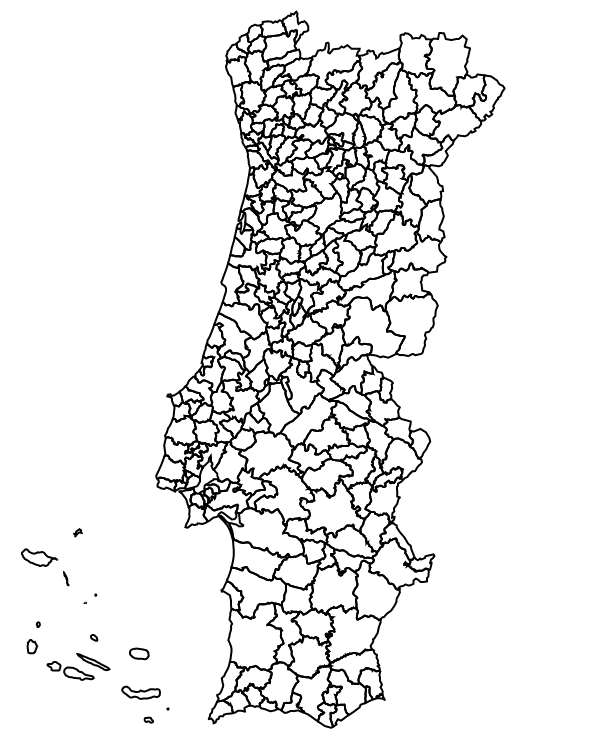
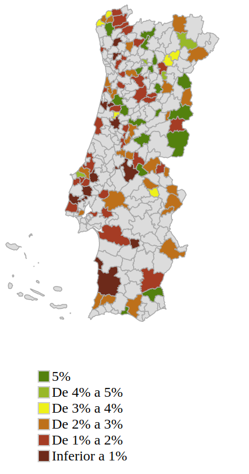

Last year I found out about a rule in the Portuguese tax code that allows local councils to give back a small percentage of the taxes to be collected back to their residents. This was seen as a measure to incentivize people to move or stay in poorer regions, which probably suffer from a shortage of jobs and services. This was a common practice in medieval times, with incentives as big as a [more lax treatment in possible crimes among them](http://repositorio.ul.pt/bitstream/10451/10602/1/ulsd067625_td_vol_1.pdf). Of course back then the risk of an Eastern invasion by a Spanish monarch was very much in the day-to-day thinking of our rulers. One can speculate that if in 2018 all the Portuguese people live by the coast is the East still Portugal? I suppose if enough Irish speakers moved there it could be claimed as part of Ireland! But I diverge.

Coming from one of the poorest regions of Portugal myself, I wondered if the “right” places were the ones indeed taking advantage of this measure and trying to attract people to live there. After a bit of research, I found that my local town didn’t use this measure but some neighbouring places did. I searched for a map so that I could visualize where this was happening and by how much (municipalities can give back up to 5% of the tax to the be collected). I didn’t find any so I thought I would create one.

###### [GitHub project](https://github.com/jdmartinho/concelhosPortugal)

###### Step 1 – Creating a municipality map in svg

This was more of a search operation than a creative one. I needed an SVG map that I could manipulate in something like JavaScript in order to load some data dynamically, such as the tax information for each council. I found one [map](https://upload.wikimedia.org/wikipedia/commons/5/59/Concelhos-sede_de_ONGAs.svg) on Wikipedia under a Creative Commons license that I could change for my purpose since it contained some errors and missed some information such as three councils. This map is not perfect because it’s missing the 30 councils that make up the archipelagos of Madeira and Açores and instead just represents the archipelago as a whole. For the purpose of this exercise, it will suffice.

###### Step 2 – Creating a Javascript map with Raphael.js

In order to create an interactive map, I used [Raphael](http://dmitrybaranovskiy.github.io/raphael/), a JavaScript library that allows using vector maps as JavaScript objects. Armed with the SVG data and with a way to create objects from it I started by following an [online tutorial](https://www.jonathan-petitcolas.com/2013/07/18/create-clickable-svg-france-regions-map.html) that taught me with a quick way to create a map. The hardest part was actually mapping (no pun intended) the vector data to the correct councils in an array. The SVG map didn’t have the right names, sometimes, and also didn’t have all of the councils. This left me with the time-consuming option of manually copying the data into the array.

After some time I had a map that correctly represented all of the councils with names and real borders. In order to use this in JavaScript I created a file, <span class="lang:default decode:true crayon-inline ">concelhosSVG.js</span> , and I created the following:

```js
var MAP_WIDTH = 280;
var MAP_HEIGHT = 400;
// The RaphaelJS container
var mapContainer = document.getElementById("map");
var map = new Raphael(mapContainer, MAP_WIDTH, MAP_HEIGHT);

// The SVG council map
var concelhosSVG = {};
```

The <span class="lang:default decode:true crayon-inline ">MAP\_WIDTH</span> and <span class="lang:default decode:true crayon-inline ">MAP\_HEIGHT</span> variables allow us to define a size to work with. The <span class="lang:default decode:true crayon-inline ">mapContainer</span> variable will be used in the map div in our HTML file to display the actual map. The <span class="lang:default decode:true crayon-inline ">map</span> variable represents the Raphael object on which we will make our manipulations.

Finally, we define concelhosSVG which will hold an index with the name of the council and the path to append to our map variable.

```js
concelhosSVG["Fundão"] = map.path("M 167.3315,144.27869 C 167.70634,143.45051 168.59824,144.40767 169.14128,143.96837 C 170.04712,144.58579 169.74261,143.61898 170.14549,143.24669 C 170.19026,143.8941 171.48098,143.92645 170.77216,143.24669 C 171.7888,143.31162 171.57197,141.49447 172.47416,142.28702 C 173.57466,141.60941 174.41483,142.86308 175.35703,142.61515 C 175.85449,142.06864 176.97441,141.43587 175.91717,140.99683 C 175.57029,139.99269 176.521,140.41021 177.00342,139.88409 C 178.53179,140.47533 179.14516,137.86824 180.52746,138.41114 C 181.56565,138.72827 182.88419,138.32989 183.93938,137.9271 C 185.12315,137.51048 186.49848,136.95014 187.46332,136.36056 C 188.04225,135.81438 189.21995,136.4105 189.86007,135.57825 C 190.4739,135.08423 190.92441,133.57199 192.03263,134.6014 C 192.52687,135.49456 192.33874,136.70338 192.60983,137.65136 C 192.36431,138.07569 191.94744,138.82352 192.92483,138.55668 C 194.26427,139.59397 191.53492,139.8331 191.80033,140.96561 C 190.71887,141.91361 191.40166,143.06556 191.5595,144.21539 C 191.56461,145.35123 190.37212,145.79036 190.25594,146.9015 C 190.05731,147.941 190.24724,149.38566 189.06964,149.89241 C 188.27628,150.66492 187.62897,151.49838 187.97416,152.73502 C 187.62442,153.47357 188.03326,155.42372 186.73033,154.38635 C 186.03375,153.77036 186.80574,152.11174 185.47275,151.96231 C 184.79746,150.89014 184.1507,153.04428 183.06861,152.60391 C 182.63624,153.02114 181.38972,154.65807 181.18383,153.60402 C 180.45187,152.64585 181.01028,151.46204 180.37774,150.52502 C 180.85331,149.1982 179.32814,148.20144 178.51965,147.70794 C 177.17502,148.31606 175.72313,147.96607 174.39348,147.55634 C 173.14133,147.64186 171.59647,148.13699 170.94954,149.3765 C 170.48481,150.40525 169.43809,150.84564 168.81686,151.71371 C 168.27551,152.15799 167.19592,151.16589 167.16849,152.28234 C 166.2034,151.94219 165.44106,150.78202 164.26049,151.44934 C 163.4227,151.00082 164.19152,150.33669 164.16856,149.96596 C 163.11965,149.78199 165.069,149.00581 163.94549,148.53402 C 164.37317,148.23278 164.73086,147.75984 163.92612,148.04423 C 162.6652,148.29997 164.33313,147.68991 164.44182,147.24835 C 165.42752,147.08441 164.55667,148.461 165.60911,148.74006 C 165.66373,148.24142 166.92474,147.46 167.41097,146.80788 C 166.14368,146.18786 168.36781,146.41623 167.84178,145.44997 C 168.00251,144.95679 167.60272,144.62105 167.3315,144.27869 z ");
```

In Raphael we can use the [SVG path syntax](http://dmitrybaranovskiy.github.io/raphael/reference.html#Paper.path) which basically allows us to start with an <span class="lang:default decode:true crayon-inline ">M</span> (move to) and add coordinates until we issue a <span class="lang:default decode:true crayon-inline ">Z</span> for ending the path.

###### Step 3 – Adding our map to html

Now that we have a map we can create a simple HTML page to include the map.

```html
<html>
<head>
<meta charset="utf-8" />
<title>Portugal councils with Raphael.js</title>
<link rel="stylesheet" href="css/style.css">
</head>
<body>
<div id="map"></div>

<script type="text/javascript" src="js/raphael.min.js"></script>
<script type="text/javascript" src="js/concelhosSVG.js"></script>

</body>
</html>
```

I’ve gone ahead and added a simple style to our CSS file

```css
/* basic positioning */
.legend {
list-style: none;
}
.legend li {
margin-right: 10px;
}
.legend span {
border: 1px solid #ccc; float: left; width: 12px; height: 12px; margin: 2px;
}
```

And here’s the result


*Portugal Council Map using Raphael.js*

###### Step 4 – Adding our tax information

Now that we have a map, albeit a very ugly one, let’s add our tax information. This information is public and you can get it from the [Portuguese Revenue website](https://www.portaldasfinancas.gov.pt/pt/consultarTaxasIRSMunicipiosForm.action).

We’ll create a new JavaScript file called <span class="lang:default decode:true crayon-inline ">concelhosIRS.js</span> and we’ll create an array inside it with all the information needed.

```js
// The Tax Benefit for each council for 2018
var concelhosIRS = {};
concelhosIRS["Abrantes"] = 0.005;
concelhosIRS["Águeda"] = 0.05;
concelhosIRS["Aguiar Da Beira"] = 0.05;
concelhosIRS["Alandroal"] = 0;
concelhosIRS["Albergaria-A-Velha"] = 0.0225;
```

###### Step 5 – Styling our map with the tax information

Finally, we just need to syle our map based on this information. In order to do that we’ll create a new JavaScript file named <span class="lang:default decode:true crayon-inline ">main.js</span> and we’ll add the following code to it.

```css
// Styles to apply
// Default style
var style = {
fill: "#ddd",
stroke: "#aaa",
"stroke-width": 1,
"stroke-linejoin": "round",
cursor: "pointer"
};

// Style when hovering
var hoverStyle = {
fill: "#A8BED5"
}

// Styles for tax brackets
var fivePercent = {
fill: "#358205"
}

var overFourPercent = {
fill: "#8FB822"
}

var overThreePercent = {
fill: "#F3EE00"
}

var overTwoPercent = {
fill: "#D76804"
}

var overOnePercent = {
fill: "#C12818"
}

var overZeroPercent = {
fill: "#801A0F"
}

var animationSpeed = 500;
```

We’ll start by adding our initial style, our style when hovering the mouse over a council and the style for each of the tax brackets. I chose to create six tax brackets between 0% and 5%. The councils that don’t offer any tax benefit will not have a colour and will just show as grey.

Next, we add a function to change the styling based on the tax benefit that the council provides.

```js
// Return style by tax bracket for provided council name using the concelhosIRS array
function corConcelho(nome) {
  if (this.concelhosIRS[nome] == 0.05) {
      return fivePercent;
  } else if (concelhosIRS[nome] >= 0.04 && concelhosIRS[nome] < 0.05) {
      return overFourPercent;
  } else if (concelhosIRS[nome] >= 0.03 && concelhosIRS[nome] < 0.04) {
      return overThreePercent;
  } else if (concelhosIRS[nome] >= 0.02 && concelhosIRS[nome] < 0.03) {
      return overTwoPercent;
  } else if (concelhosIRS[nome] >= 0.01 && concelhosIRS[nome] < 0.02) {
      return overOnePercent;
  } else if (concelhosIRS[nome] > 0.00 && concelhosIRS[nome] < 0.01) {
      return overZeroPercent;
  } else {
      return style;
  }
}
```

And we wrap everything together by adding our main code that initialises the map colours and adds our event listeners for when we hover our mouse over a council and move out.

```js
// Main loop
// Initializes the map with default styles
// Adds event listeners for mouseover and mouseout to allow us to see which council we are selecting
for (var concelhoName in concelhosSVG) {
  (function(concelho, nome) {
    concelho.attr(style);
    concelho.attr(corConcelho(nome));

    concelho[0].addEventListener("mouseover", function() {
      concelho.animate(hoverStyle, animationSpeed);
      document.getElementById('popup').style.display = 'block';
      document.getElementById('popup').innerHTML = nome;

    }, true);

    concelho[0].addEventListener("mouseout", function() {
      concelho.animate(corConcelho(nome), animationSpeed);
      document.getElementById('popup').style.display = 'none';
      document.getElementById('popup').innerHTML = null;
    }, true);

  })(this.concelhosSVG[concelhoName], concelhoName);
}
```

###### Final result and notes

After a few updates to our HTML file, we end up with the following map.



*Final map with colours*

Much nicer right?

You can find all the [source code on GitHub](https://github.com/jdmartinho/concelhosPortugal) if you want to take a look or try it out for yourself.

I’ll throw some additional notes just so you’re aware of them:

- I have not used councils for Azores and Madeira as I couldn’t find any usable SVG for them. I also suspect they would be tiny to select, as some councils in the continent already are. The tax data for them are mapped in concelhosIRS.js though.
- I have used global variables for the tax data and the Raphael map. I did this because it was a learning exercise for me around Raphael and SVG and not programming. Global variables are fine to use in very small projects such as this tutorial but you shouldn’t use them in any production code or larger collaborative projects. [Start here](https://stackoverflow.com/questions/1841916/how-to-avoid-global-variables-in-javascript) and do your own research.
- A shout out to Andy Fitch who also has a [nice tutorial on this subject.](https://parall.ax/blog/view/2985/tutorial-creating-an-interactive-svg-map)

</body></html>