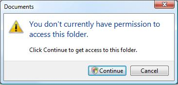
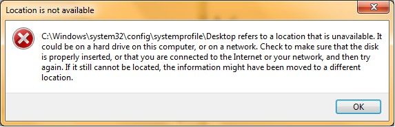

#### The Problem

This weekend I needed to access some external hard drive folders on a Windows laptop. We follow a [united colours](https://innovativedesignhistory.wordpress.com/2014/04/08/the-united-colors-of-benetton-campaign-history/) approach to our systems at home, which, just like in the real world comes with a big set of advantages and occasional challenges. One of the downsides is the fact that each operating system uses different file systems.

This hard drive, in particular, had folders that had been created in an Ubuntu Linux laptop and some that have been created in a macOS laptop. They needed to be read on a Windows 10 laptop. Should this be easy? The honest answer in my experience? Most of the times, but not always…which can be abbreviated as sometimes!

Now, I’m not going to comment on Apple’s reluctance in accepting different colours and flavours of file systems and tools than their own but this is usually the biggest challenge. Over the years I found that Windows and Ubuntu play nicely with each other than macOS. Not this time though.

I mounted my hard drive on Windows and could see all my folders. but when accessing them I was confronted with two different types of issues.

Some folders were complaining that I didn’t have permission to access them. I matched all of these as folders that were created in macOS. This was a non-issue as I just had to give myself permission to access them by confirming the popup dialogue, just like in the image below.

*Make sure you just give yourself permission to access the folder*

With the rest of the folders, I had a different issue though.

*Location not available*

My folder was not available. The suggestions weren’t very helpful either. I searched online for a solution but most of them were pretty heavy-handed and involved formatting my file system, which could lead to losing my data.

#### The Solution

I did some online research on differences between HFS, NTFS and ext4. I already knew some things, others didn’t and yet I couldn’t find a solution that matched my case. And then, just as a lightbulb going up (or any other analogy for a [Eureka moment](https://en.wikipedia.org/wiki/Eureka_(word))) I remembered an almost insignificant and superficial detail.

Some of my folders were accessible after giving my user permission. Not only these folders were created on macOS but they also didn’t have one particular character in their names, “**:**“. Windows systems don’t allow the use of colon characters due to them serve as a drive separator, such as in “C:”. In macOS, because it’s a Unix based system you can technically use a colon in filenames but not through Finder. Finder doesn’t allow you to do this due to historical reasons. I know most people use Finder to create folders since it’s the easiest way to drag and drop files. These folders didn’t have any colon characters because we can’t save them with them! The solution was apparent.

I plugged in my hard drive in my Linux laptop, promptly got rid of the colon characters and lo and behold it now didn’t complain at all in Windows!

I felt this was one of those moments where the solution was staring you in the face and yet you couldn’t see it for it was so simple that it just couldn’t be that.

Hopefully, this will help anyone with the same corner-case that I faced!